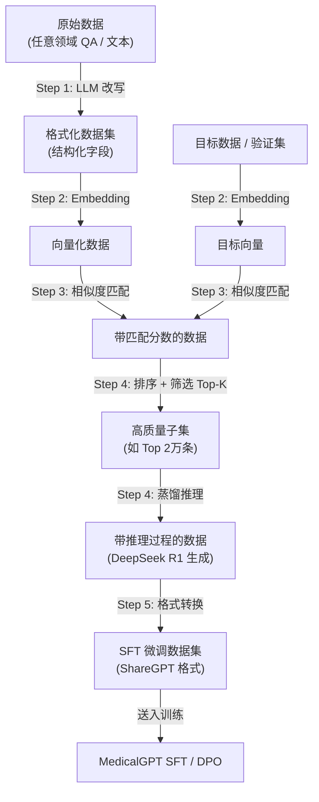

# 利用 HealthAI-2025 方法构造自定义数据集

> 本指南将 HealthAI-2025 仓库的数据构造方法抽象为**通用流程**，帮你理解如何将任意领域的原始数据加工为可用于 MedicalGPT 训练的高质量数据集。

---

## 一、整体流程总览



---

## 二、各步骤详解与代码对应

### Step 1：LLM 改写 — 将原始数据结构化

**对应脚本**：[1.批量推理构造数据集.py](file:///Users/baiding/Desktop/HealthAI-2025/1.批量推理构造数据集.py)

**做了什么**：
- 输入：Huatuo-26M 原始医疗问答（`question` + `answer` + `related_diseases`）
- 调用 **GLM-4** 批量 API，将非结构化问答改写为结构化临床格式
- 输出字段：`feature_content`（含性别/年龄/主诉/现病史等）、`reason`、`diseases`、`score`

**如何替换成你的领域**：

```python
# 原始 prompt 中的关键部分（医疗版）：
"提取患者的主诉、检查结果和病史..."
"格式化为：性别/年龄/主诉/现病史/既往史..."

# 如果换成法律领域，改为：
"提取案件的基本事实、争议焦点..."
"格式化为：案件类型/当事人/诉讼请求/事实认定/法律依据..."

# 如果换成金融领域，改为：
"提取公司的财务状况、风险因素..."
"格式化为：公司名称/行业/主要指标/风险点/投资建议..."
```

**API 替换方案**：

| 原方案 | 替代方案 | 说明 |
|--------|---------|------|
| 智谱 GLM-4 批量 API | DeepSeek API | 更便宜，效果好 |
| | OpenAI 兼容 API + Qwen | 本地部署零成本 |
| | 硅基流动 SiliconFlow | 国内便宜 API |

**成本估算**（以 17.8 万条数据为例）：
- GLM-4 批量推理：约 ¥50-100
- DeepSeek V3 API：约 ¥30-60
- 本地 Qwen-72B（AutoDL A100）：约 ¥20-40

---

### Step 2：向量化 — 给每条数据生成 Embedding

**对应脚本**：
- [2.向量化构造的数据集.py](file:///Users/baiding/Desktop/HealthAI-2025/2.向量化构造的数据集.py)（向量化你构造的数据）
- [2.向量化验证集.py](file:///Users/baiding/Desktop/HealthAI-2025/2.向量化验证集.py)（向量化目标/验证数据）

**做了什么**：
- 对 `feature_content` 字段调用 **GLM-Embedding-3** 生成向量
- 多线程并发加速（10-50 线程）
- 输出：每条数据追加 `feature_vector` 字段

**如何替换**：

```python
# 原方案：智谱 Embedding API
response = client.embeddings.create(model="embedding-3", input=text)

# 替代方案 1：本地 Embedding（零成本，推荐）
from sentence_transformers import SentenceTransformer
model = SentenceTransformer('BAAI/bge-large-zh-v1.5')  # 中文最佳开源模型
vectors = model.encode(texts, batch_size=64, show_progress_bar=True)

# 替代方案 2：OpenAI Embedding
from openai import OpenAI
client = OpenAI()
response = client.embeddings.create(model="text-embedding-3-small", input=text)
```

> **推荐用本地 BGE 模型**：不花钱，速度快，AutoDL 上有 GPU 跑几分钟就搞定。

---

### Step 3：相似度匹配 — 筛选与目标最接近的数据

**对应脚本**：[3.相似度匹配（矩阵计算法）.py](file:///Users/baiding/Desktop/HealthAI-2025/3.相似度匹配（矩阵计算法）.py)

**做了什么**：
1. 加载目标数据向量（如官方验证集 3K 条）和构造数据向量（17.8 万条）
2. 归一化向量，计算余弦相似度矩阵（`np.dot`）
3. 每条构造数据找出与目标数据最相似的 Top-5
4. 输出：每条数据追加 `matches` 字段（含 `match_score`）

**核心逻辑**（纯 numpy，无需 API）：

```python
# 矩阵计算余弦相似度
similarity_matrix = np.dot(query_normalized, target_normalized.T)

# 取每行 Top-5
top_indices = np.argpartition(-similarity_matrix, 5, axis=1)[:, :5]
```

**如何适配你的场景**：
- 如果没有"官方验证集"作为目标分布，你可以：
  - **手动标注 100-500 条**高质量样本作为目标
  - 或者用你要训练的模型已有的少量优质数据
  - 或者从竞品/论文的测试集中获取

---

### Step 4：排序筛选 + 蒸馏推理

**对应脚本**：[4.排序、筛选、批量推理.py](file:///Users/baiding/Desktop/HealthAI-2025/4.排序、筛选、批量推理.py)

**做了什么**：
1. **排序**：对每条数据的 Top-5 匹配分数取平均值，按均值降序排列
2. **筛选**：取前 2 万条（与目标分布最接近的高质数据）
3. **蒸馏**：将筛选后的 `feature_content` 发给 **DeepSeek R1**，让它生成推理过程（`reasoning_content`）和诊断结果

**蒸馏的关键**：你付费让强模型"思考"一遍，然后把它的思考过程作为训练数据教给小模型。

**成本估算**（2 万条 × DeepSeek R1）：
- 批量推理约 ¥100-200

---

### Step 5：制作 SFT 微调数据集

**对应脚本**：[5.制作微调数据.py](file:///Users/baiding/Desktop/HealthAI-2025/5.制作微调数据.py)

**做了什么**：
1. 合并 Step 4 的推理结果（`reasoning_content` + `reason` + `diseases`）
2. 转换为 **ShareGPT 格式**（`conversations` 数组）
3. 数据质量检查：推理内容 ≥ 150 字，诊断依据格式正确

**最终输出格式**（兼容 MedicalGPT 和 LLaMA Factory）：

```json
{
  "conversations": [
    {"from": "human", "value": "性别: 女\n年龄: 65\n主诉: 痰中带血3天\n..."},
    {"from": "gpt", "value": "{\"reasoning_content\": \"好的，我需要分析...\", \"reason\": \"1. 主诉...\", \"diseases\": \"急性上呼吸道感染\"}"}
  ],
  "system": "你是一名资深全科医生..."
}
```

---

## 三、替换为其他领域的完整示例

假设你要做一个**法律判决预测**模型：

### 数据来源
- 裁判文书网公开数据（类似 Huatuo 的角色）
- 或 [CAIL2018 数据集](https://github.com/china-ai-law-challenge/CAIL2018)

### Step 1：改写 prompt

```python
prompt = '''
你是一名资深法官，请分析以下案件：
1. 提取案件基本信息
2. 给出法律分析和判决依据

<案件描述>
{case_description}
</案件描述>

输出格式：
{
  "case_type": "案件类型",
  "parties": "当事人",
  "facts": "案件事实",
  "legal_basis": "法律依据",
  "judgment": "判决结果",
  "feature_content": "案件类型: [值]\n当事人: [值]\n诉讼请求: [值]\n事实认定: [值]\n争议焦点: [值]"
}
'''
```

### Step 2-3：向量化 + 筛选（代码几乎不用改）

只需替换输入文件路径和字段名。

### Step 4：蒸馏 prompt

```python
system_prompt = '''你是一名资深法官，请分析案件并给出判决：
1. 详细的法律推理过程
2. 引用的法律条文
返回 JSON 格式：
{
  "reasoning_content": "法律推理过程",
  "legal_basis": "适用法律和条文",
  "judgment": "判决结果"
}'''
```

### Step 5：输出直接兼容 MedicalGPT

```json
{
  "conversations": [
    {"from": "human", "value": "案件类型: 合同纠纷\n当事人: 张某 vs 李某\n诉讼请求: ..."},
    {"from": "gpt", "value": "{\"reasoning_content\": \"本案涉及合同法...\", \"legal_basis\": \"...\", \"judgment\": \"...\"}"}
  ],
  "system": "你是一名资深法官..."
}
```

---

## 四、产出数据如何对接 MedicalGPT

### 用于 SFT 阶段

Step 5 的输出已经是 ShareGPT 格式，直接放入 `data/finetune/` 即可：

```bash
cp your_sft_data.jsonl MedicalGPT/data/finetune/
python supervised_finetuning.py --train_file_dir ./data/finetune ...
```

### 用于 DPO 阶段

需要额外构造偏好数据。方法：

```python
# 用 Step 5 的数据生成 chosen/rejected 对
# chosen = DeepSeek R1 的高质量回答
# rejected = 基座模型（未微调）的低质量回答

import json

sft_data = [json.loads(l) for l in open("your_sft_data.jsonl")]
dpo_data = []

for item in sft_data:
    question = item["conversations"][0]["value"]
    chosen = item["conversations"][1]["value"]  # R1 蒸馏的回答
    
    # rejected 可以通过以下方式获取：
    # 1. 用未微调的基座模型生成
    # 2. 或用 Step 1 中原始的低质量回答
    rejected = get_base_model_response(question)  # 需自己实现
    
    dpo_data.append({
        "question": question,
        "response_chosen": chosen,
        "response_rejected": rejected
    })

with open("data/reward/my_dpo_data.jsonl", "w") as f:
    for item in dpo_data:
        f.write(json.dumps(item, ensure_ascii=False) + "\n")
```

### 用于 PT 阶段

如果你有大量领域纯文本（如法律法规全文、医学教材等），直接放 `.txt` 文件到 `data/pretrain/` 即可，不需要用 HealthAI 的方法处理。

---

## 五、最终项目结构

```
MedicalGPT/
├── data/
│   ├── pretrain/
│   │   └── my_domain_corpus.txt          ← 领域纯文本（PT 用）
│   ├── finetune/
│   │   └── my_distilled_sft_data.jsonl   ← Step 5 产出（SFT 用）
│   ├── reward/
│   │   └── my_dpo_data.jsonl             ← 构造的偏好数据（DPO 用）
│   └── grpo/
│       └── my_qa_data.jsonl              ← QA 格式（GRPO 用，可选）
```

---

## 六、成本与时间估算

| 步骤 | 工具 | 成本 | 时间 |
|------|------|------|------|
| Step 1: 数据改写 | DeepSeek V3 API | ¥30-60 (17.8万条) | 2-4 小时 |
| Step 2: 向量化 | 本地 BGE 模型 | ¥0 | 10-30 分钟 |
| Step 3: 相似度 | 纯 numpy | ¥0 | 5-10 分钟 |
| Step 4: 蒸馏 | DeepSeek R1 API | ¥100-200 (2万条) | 4-8 小时 |
| Step 5: 格式转换 | 本地脚本 | ¥0 | 1 分钟 |
| **合计** | | **¥130-260** | **~1 天** |

> 如果数据量小（如 1 万条），成本可控制在 **¥50 以内**。
