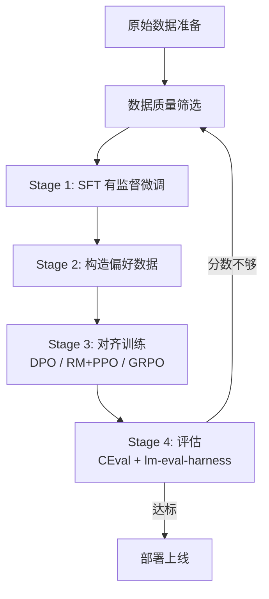
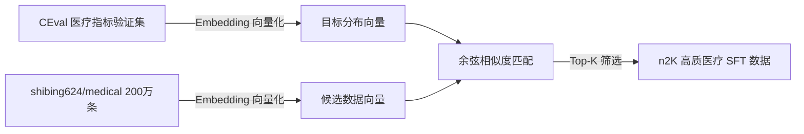
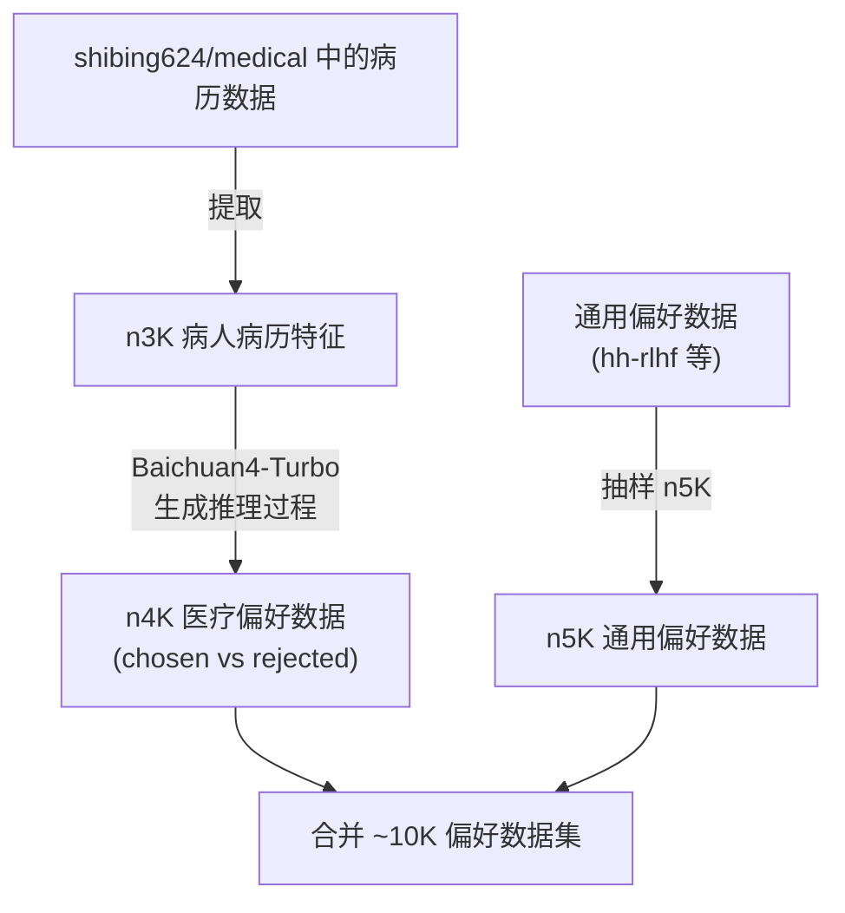

# 医疗大模型训练全流程最佳实践

> 结合 MedicalGPT 框架 + HealthAI-2025 数据构造思路 + lm-evaluation-harness 评测，给出一套从数据到评估的完整实操方案。

---

## 一、整体流程概览



---

## 二、数据准备（最关键的环节）

### 2.1 数据来源

| 类型 | 来源 | 数量级 | 用途 |
|------|------|--------|------|
| 医疗通用 | [shibing624/medical](https://huggingface.co/datasets/shibing624/medical) | ~200 万条 | PT / SFT / Reward 全阶段 |
| 通用对话 | [sharegpt_gpt4](https://huggingface.co/datasets/shibing624/sharegpt_gpt4) | ~6K 条 | SFT 通用能力保持 |
| 通用偏好 | [Dahoas/full-hh-rlhf](https://huggingface.co/datasets/Dahoas/full-hh-rlhf) | ~11 万条 | Reward / DPO 通用偏好 |

### 2.2 SFT 数据构造（向量相似度筛选法）

> 核心思路：不是数据越多越好，而是**与目标分布最接近的高质数据**效果最好。



**具体步骤**：

```python
# 1. 将 CEval 医疗验证集向量化作为目标分布
from sentence_transformers import SentenceTransformer
model = SentenceTransformer('BAAI/bge-large-zh-v1.5')

# 目标分布
ceval_texts = [q["question"] for q in load_ceval_medical()]
target_embeddings = model.encode(ceval_texts)

# 2. 将 shibing624/medical 200 万条向量化
medical_texts = [item["question"] for item in load_medical_dataset()]
candidate_embeddings = model.encode(medical_texts, batch_size=256)

# 3. 计算相似度并筛选 top-K
from sklearn.metrics.pairwise import cosine_similarity
import numpy as np

scores = cosine_similarity(candidate_embeddings, target_embeddings)
avg_scores = scores.max(axis=1)  # 每条数据与最近目标的相似度
top_indices = np.argsort(avg_scores)[-2000:]  # 选出最相关的 2000 条

selected_data = [medical_texts[i] for i in top_indices]
```

**SFT 数据配比建议**：

```
n1K 通用对话数据（保持通用能力）
+ n2K 筛选后的高质医疗数据（注入领域知识）
= 3K 条 SFT 训练数据
```

### 2.3 偏好数据构造（用于 DPO / RM+PPO）

**方法**：用强模型（如 Baichuan4-Turbo / DeepSeek R1）生成推理数据和偏好对。



**偏好数据生成方法**：

```python
# 用强模型生成 chosen 回答
chosen_response = call_api(
    model="deepseek-r1",  
    prompt=f"作为资深医生分析病例：{patient_feature}",
    system="请给出详细的诊断推理过程和结论"
)

# 用弱模型或截断方式生成 rejected 回答
rejected_response = call_api(
    model="qwen2.5-7b-base",  # 未微调的基座模型
    prompt=f"分析病例：{patient_feature}"
)

# 组成偏好对
preference_item = {
    "question": patient_feature,
    "response_chosen": chosen_response,
    "response_rejected": rejected_response
}
```

---

## 三、训练流程

### Base Model 选择

| 模型 | 优势 | 适用场景 |
|------|------|---------|
| **Qwen2.5-3B** | 中文能力强，显存友好 | 入门练手、快速迭代 |
| **Llama3.2-3B** | 推理能力强，社区活跃 | 英文场景、轻量部署 |
| **Qwen2.5-7B** | 效果更好，中文医疗首选 | 正式项目、AutoDL 训练 |

### 3.1 SFT 阶段

```bash
python supervised_finetuning.py \
    --model_name_or_path Qwen/Qwen2.5-7B \
    --train_file_dir ./data/sft_selected \    # 筛选后的数据
    --template_name qwen \
    --per_device_train_batch_size 1 \
    --gradient_accumulation_steps 4 \
    --num_train_epochs 3 \
    --learning_rate 2e-5 \
    --use_peft True \
    --lora_rank 8 \
    --fp16 \
    --gradient_checkpointing True \
    --output_dir outputs-sft-v1
```

> [!IMPORTANT]
> **SFT 后先评测一次 CEval**，确认医疗分数没有下降。如果下降了，说明数据配比需要调整（增加通用数据比例）。

### 3.2 对齐阶段（三选一）

#### 路线 A：DPO（推荐入门）

```bash
python dpo_training.py \
    --model_name_or_path ./merged-sft \
    --train_file_dir ./data/preference_10k \
    --template_name qwen \
    --use_peft True \
    --max_steps 200 \
    --fp16 \
    --output_dir outputs-dpo-v1
```

#### 路线 B：RM + PPO（效果更好但更复杂）

```bash
# Step 1: 训练 Reward Model
python reward_modeling.py \
    --model_name_or_path ./merged-sft \
    --train_file_dir ./data/preference_10k \
    --fp16 \
    --output_dir outputs-rm-v1

# Step 2: PPO 训练
python ppo_training.py \
    --sft_model_path ./merged-sft \
    --reward_model_path ./merged-rm \
    --template_name qwen \
    --output_dir outputs-ppo-v1
```

#### 路线 C：GRPO（适合推理能力训练）

```bash
python grpo_training.py \
    --model_name_or_path ./merged-sft \
    --train_file_dir ./data/grpo \
    --output_dir outputs-grpo-v1
```

自定义奖励函数来引导模型行为：

```python
# 在 grpo_training.py 中修改
def medical_accuracy_reward(completions, answer, **kwargs):
    """检查诊断是否正确"""
    rewards = []
    for completion in completions:
        if answer[0].lower() in completion.lower():
            rewards.append(1.0)
        else:
            rewards.append(0.0)
    return rewards

def medical_format_reward(completions, **kwargs):
    """检查是否按要求格式输出（推理过程 + 结论）"""
    rewards = []
    for completion in completions:
        has_reasoning = "<think>" in completion and "</think>" in completion
        has_answer = "<answer>" in completion and "</answer>" in completion
        rewards.append(1.0 if (has_reasoning and has_answer) else 0.0)
    return rewards
```

---

## 四、评估方案

### 4.1 用 lm-evaluation-harness 评测

```bash
# 安装
pip install lm-eval

# 各阶段对比评测
for stage in base sft dpo; do
    lm_eval --model hf \
        --model_args pretrained=./merged-${stage},trust_remote_code=True,dtype=float16 \
        --tasks ceval-valid,mmlu_clinical_knowledge,mmlu_professional_medicine \
        --batch_size auto \
        --num_fewshot 5 \
        --output_path ./eval_results/${stage}
done
```

### 4.2 关键指标

| 指标 | 工具 | 说明 |
|------|------|------|
| **CEval physician（医学资格）** | lm-eval-harness | 核心指标，体现医学知识水平 |
| **PPL（困惑度）** | eval_quantize.py | 在 1K 医疗数据上的困惑度，越低越好 |
| **MMLU Medical** | lm-eval-harness | 英文医学知识（如有英文需求） |
| **人工评测** | inference.py | 抽样看实际回答质量 |

### 4.3 预期结果报告格式

```
CEval physician（医学资格）：基座 xx% → SFT xx% → DPO xx%（提升 x 个点）
PPL（1K 医疗数据）：基座 xx → SFT xx → DPO xx（下降 xx%）
```

> [!WARNING]
> **避免把评测集当训练集**：如果用 CEval 医疗验证集做向量筛选的目标分布，评测时要意识到这可能导致分数虚高。面试时需要说明这一点，并补充在**其他独立测试集**上的表现。

---

## 五、简历包装要点

**一句话描述**：基于 MedicalGPT 框架，完成了医疗大模型 SFT + RLHF 全链路训练，在 Qwen2.5-7B 和 Llama3.2-3B 上实验，CEval 医学资格分数提升 X 个百分点。

**技术亮点可以写**：
1. 向量相似度数据筛选 — 从 200 万条数据中筛选与目标分布最匹配的高质数据
2. 多阶段对齐训练 — 实现 DPO / RM+PPO / GRPO 三种对齐方法的对比实验
3. 标准化评测体系 — 使用 lm-evaluation-harness + CEval 进行可复现的评估
4. 偏好数据构造 — 利用强模型蒸馏生成 chosen/rejected 数据对

**需要填的数字（跑完实验后补充）**：
- n1、n2、n3、n4、n5：各阶段数据量
- CEval 提升幅度
- PPL 下降幅度
- 训练耗时和资源消耗
