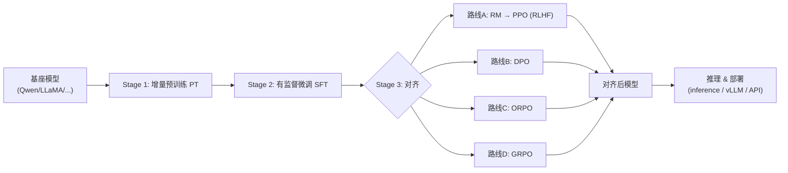
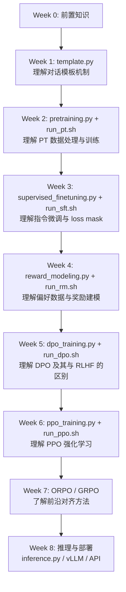

# MedicalGPT 项目概览与学习指南

> 本文档是对 [shibing624/MedicalGPT](https://github.com/shibing624/MedicalGPT) 项目的系统性分析，旨在帮助你快速理解项目架构、数据流向、技术栈，并提供一条线性的学习路径。

---

## 一、项目定位

MedicalGPT 是一个**医疗领域大模型训练框架**，完整复现了 ChatGPT 的训练流水线（Training Pipeline）。它不仅适用于医疗场景，也可迁移到任意垂直领域。核心价值在于：将 PT → SFT → 对齐（RLHF / DPO / ORPO / GRPO）的全链路用清晰的单文件脚本实现出来，降低了学习和复现门槛。

---

## 二、整体架构与数据流



**核心数据流方向**：`原始文本 → 领域模型 → 指令模型 → 对齐模型 → 可用服务`

---

## 三、各阶段详解

### Stage 1：增量预训练（Continue Pretraining）

| 维度 | 内容 |
|------|------|
| **目的** | 让基座模型适应领域数据分布，学习领域词汇和知识 |
| **脚本** | [pretraining.py](file:///Users/baiding/Desktop/MedicalGPT/pretraining.py) |
| **启动命令** | [run_pt.sh](file:///Users/baiding/Desktop/MedicalGPT/run_pt.sh) |
| **核心类** | `ModelArguments` / `DataArguments` / `ScriptArguments` → `Trainer` |
| **模型API** | `AutoModelForCausalLM`（标准因果语言模型） |

#### 数据构造

- **输入格式**：纯文本文件（`.txt`），一篇文章一个文件
- **示例目录**：`data/pretrain/`（含 `tianlongbabu.txt`、`fever.txt` 等）
- **处理流程**：
  1. `tokenize_function()`：对文本进行分词，截断到 `block_size`
  2. `group_text_function()`（Packing 模式）：将多篇文档用 EOS 拼接，再切分为固定长度块
     - `[doc1_ids][EOS][doc2_ids][EOS]...` → 每块 `block_size` 个 token
  3. 训练目标：标准的 **下一个词预测（Next Token Prediction）**

#### 关键参数

```bash
--block_size 512          # 序列长度
--packing True            # 是否启用文档拼接（推荐开启，提升训练效率）
--use_peft True           # 使用 LoRA
--lora_rank 8             # LoRA 秩
--learning_rate 2e-4      # 预训练学习率偏大
```

---

### Stage 2：有监督微调（Supervised Fine-Tuning）

| 维度 | 内容 |
|------|------|
| **目的** | 教模型理解指令、注入领域知识、学会对话格式 |
| **脚本** | [supervised_finetuning.py](file:///Users/baiding/Desktop/MedicalGPT/supervised_finetuning.py) |
| **启动命令** | [run_sft.sh](file:///Users/baiding/Desktop/MedicalGPT/run_sft.sh) |
| **核心类** | `SavePeftModelTrainer(Trainer)` + `preprocess_function()` |
| **模型API** | `AutoModelForCausalLM` + `DataCollatorForSeq2Seq` |

#### 数据构造

- **输入格式**：JSONL（ShareGPT 格式），每行一个多轮对话
- **示例目录**：`data/finetune/`

```json
{
  "conversations": [
    {"from": "human", "value": "小孩发烧怎么办？"},
    {"from": "gpt", "value": "发烧是身体对感染的自然反应..."},
    {"from": "human", "value": "需要吃什么药？"},
    {"from": "gpt", "value": "建议使用布洛芬..."}
  ]
}
```

- **处理流程**（`preprocess_function` → `get_dialog`）：
  1. 使用 `template.py` 中的模板将对话格式化为模型期望的 prompt 格式
  2. 对用户输入部分的 label 设为 `-100`（不计算 loss），**只对模型回答部分计算 loss**
  3. 支持多轮对话拼接

#### 模板系统（关键机制）

[template.py](file:///Users/baiding/Desktop/MedicalGPT/template.py) 定义了 20+ 种模型的对话模板。以 Qwen 为例：

```
<|im_start|>system
You are a helpful assistant.<|im_end|>
<|im_start|>user
{query}<|im_end|>
<|im_start|>assistant
{response}<|im_end|>
```

> [!IMPORTANT]
> `template_name` 参数必须与你使用的基座模型匹配，否则模型无法正常理解 prompt 结构。

#### 关键参数

```bash
--template_name qwen      # 模板名称，务必与模型匹配
--model_max_length 4096    # 最大序列长度
--learning_rate 2e-5       # SFT 阶段学习率比 PT 小一个数量级
--flash_attn True          # Flash Attention 加速
--train_on_inputs False    # 不在 prompt 部分计算 loss（默认）
```

---

### Stage 3A：奖励模型建模（Reward Modeling）

| 维度 | 内容 |
|------|------|
| **目的** | 训练一个打分器，学习人类偏好（helpful, honest, harmless） |
| **脚本** | [reward_modeling.py](file:///Users/baiding/Desktop/MedicalGPT/reward_modeling.py) |
| **启动命令** | [run_rm.sh](file:///Users/baiding/Desktop/MedicalGPT/run_rm.sh) |
| **核心类** | `RewardTrainer(Trainer)` + `RewardDataCollatorWithPadding` |
| **模型API** | `AutoModelForSequenceClassification`（注意：不是 CausalLM！） |

#### 数据构造

- **输入格式**：JSONL，含 chosen/rejected 对比对
- **示例目录**：`data/reward/`

```json
{
  "system": "",
  "history": [],
  "question": "20个关于新鲜果汁菜单的口号",
  "response_chosen": "这里是一个名为Dishes的餐厅的20个口号...",
  "response_rejected": "1. 与菜肴一起品尝新鲜！..."
}
```

- **处理流程**（`preprocess_reward_function`）：
  1. 将 question + response_chosen 拼接为 `input_ids_chosen`
  2. 将 question + response_rejected 拼接为 `input_ids_rejected`
  3. 使用 InstructGPT 的 **Pairwise Log Loss** 训练：`loss = -log(σ(r_chosen - r_rejected))`

> [!WARNING]
> RM 暂不支持 `torchrun` 多卡训练，只能用 `python` 直接运行（多卡通过 `CUDA_VISIBLE_DEVICES` 指定）。

---

### Stage 3B：PPO 强化学习

| 维度 | 内容 |
|------|------|
| **目的** | 用奖励模型引导 SFT 模型生成更符合人类偏好的回答 |
| **脚本** | [ppo_training.py](file:///Users/baiding/Desktop/MedicalGPT/ppo_training.py) |
| **启动命令** | [run_ppo.sh](file:///Users/baiding/Desktop/MedicalGPT/run_ppo.sh) |
| **核心组件** | `PPOTrainer` + `PPOConfig`（来自 TRL） |

#### 数据与流程

```
SFT 模型（策略模型）  ←  生成回答
                          ↓
              奖励模型打分（RM）
                          ↓
              PPO 算法更新策略模型
```

- **输入**：SFT 微调数据中的 prompt（不需要 answer）
- **需要两个模型路径**：`--sft_model_path` 和 `--reward_model_path`
- 训练时模型生成回答 → RM 打分 → PPO 更新参数

---

### Stage 3C：DPO 直接偏好优化

| 维度 | 内容 |
|------|------|
| **目的** | 跳过 RM，直接用偏好数据优化语言模型 |
| **脚本** | [dpo_training.py](file:///Users/baiding/Desktop/MedicalGPT/dpo_training.py) |
| **启动命令** | [run_dpo.sh](file:///Users/baiding/Desktop/MedicalGPT/run_dpo.sh) |
| **核心组件** | `DPOTrainer` + `DPOConfig`（来自 TRL） |

#### 数据构造

使用与 RM 相同的偏好数据（`data/reward/`），但处理方式不同：

`return_prompt_and_responses()` 将数据转为三元组：

```python
{
    'prompt': "system_prompt + history + question",
    'chosen': "preferred_response",
    'rejected': "less_preferred_response"
}
```

#### 与 RLHF 的对比

| 方面 | RLHF (RM+PPO) | DPO |
|------|---------------|-----|
| 是否需要 RM | ✅ 需要 | ❌ 不需要 |
| 训练复杂度 | 高（两个模型） | 低（单模型） |
| 显存占用 | 大 | 小 |
| 效果 | 理论上更灵活 | 实践中效果接近甚至更好 |

---

### Stage 3D：ORPO 比值比偏好优化

| 维度 | 内容 |
|------|------|
| **目的** | 将 SFT 和偏好对齐合并为一步，缓解灾难性遗忘 |
| **脚本** | [orpo_training.py](file:///Users/baiding/Desktop/MedicalGPT/orpo_training.py) |
| **启动命令** | [run_orpo.sh](file:///Users/baiding/Desktop/MedicalGPT/run_orpo.sh) |
| **核心组件** | `ORPOTrainer` + `ORPOConfig`（来自 TRL） |
| **论文** | [ORPO: Monolithic Preference Optimization without Reference Model](https://arxiv.org/abs/2403.07691) |

- 不需要参考模型（ref_model），训练效率更高
- 数据格式与 DPO 相同（prompt + chosen + rejected）
- 适合从基座模型直接对齐（跳过 SFT 阶段）

---

### Stage 3E：GRPO 群体相对策略优化

| 维度 | 内容 |
|------|------|
| **目的** | 纯 RL 方法训练推理能力，可以体验 "aha moment" |
| **脚本** | [grpo_training.py](file:///Users/baiding/Desktop/MedicalGPT/grpo_training.py) |
| **启动命令** | [run_grpo.sh](file:///Users/baiding/Desktop/MedicalGPT/run_grpo.sh) |
| **核心组件** | `GRPOConfig` + `GRPOTrainer`（来自 TRL） |
| **论文** | [DeepSeekMath: GRPO](https://arxiv.org/pdf/2402.03300) |

#### 数据构造

```json
{"question": "肛门病变可能是什么疾病的症状?", "answer": "食管克罗恩病"}
```

- 使用 **QA 格式**而非偏好对比格式
- 内置两种奖励函数：
  - `accuracy_reward()`：检查生成答案与 ground truth 是否匹配
  - `format_reward()`：检查输出是否包含 `<think>...</think><answer>...</answer>` 格式
- 支持 QLoRA 训练，优化长上下文（32K）场景下的显存

---

## 四、技术栈总览

| 层次 | 技术 | 用途 |
|------|------|------|
| **训练框架** | HuggingFace Transformers | 模型加载、Tokenizer、Trainer |
| **对齐训练** | TRL (trl) | DPOTrainer / PPOTrainer / ORPOTrainer / GRPOTrainer |
| **高效微调** | PEFT | LoRA / QLoRA（4bit/8bit 量化） |
| **分布式训练** | `torchrun` + DeepSpeed | 多卡并行、ZeRO 优化（zero1/2/3.json） |
| **注意力加速** | Flash Attention 2 | 长序列训练加速 |
| **推理部署** | vLLM / FastAPI / Gradio | 高性能推理 / API 服务 / Web UI |
| **RAG** | `chatpdf.py` | 基于文档的检索增强生成 |
| **数据集管理** | HuggingFace Datasets | 数据加载与预处理 |
| **量化** | BitsAndBytes | INT4/INT8 量化加载 |

---

## 五、项目文件导航

```
MedicalGPT/
├── pretraining.py              ← Stage 1: 增量预训练
├── supervised_finetuning.py    ← Stage 2: 有监督微调
├── reward_modeling.py          ← Stage 3A: 奖励建模
├── ppo_training.py             ← Stage 3B: PPO 强化学习
├── dpo_training.py             ← Stage 3C: DPO 直接偏好优化
├── orpo_training.py            ← Stage 3D: ORPO 比值比偏好优化
├── grpo_training.py            ← Stage 3E: GRPO 群体相对策略优化
│
├── template.py                 ← 🔑 对话模板管理（20+ 模型模板）
├── run_*.sh                    ← 各阶段的启动脚本（含参数示例）
├── zero1/2/3.json              ← DeepSpeed 配置文件
│
├── data/
│   ├── pretrain/               ← 预训练文本（.txt）
│   ├── finetune/               ← SFT 指令数据（ShareGPT JSONL）
│   ├── reward/                 ← 偏好数据（chosen/rejected JSONL）
│   └── grpo/                   ← GRPO QA 数据（question/answer JSONL）
│
├── inference.py                ← 单卡推理
├── inference_multigpu_demo.py  ← 多卡推理
├── merge_peft_adapter.py       ← 合并 LoRA 权重到基座模型
├── gradio_demo.py              ← Gradio Web 界面
├── fastapi_server_demo.py      ← FastAPI 服务
├── openai_api.py               ← OpenAI 兼容 API
├── chatpdf.py                  ← RAG 文档问答
└── docs/                       ← 补充文档
    ├── training_params.md      ← 训练参数说明
    ├── datasets.md             ← 数据集说明
    └── extend_vocab.md         ← 词表扩充
```

---

## 六、各阶段数据格式速查

| 阶段 | 目录 | 格式 | 关键字段 |
|------|------|------|---------|
| PT | `data/pretrain/` | `.txt` 纯文本 | 无结构，一篇文章一个文件 |
| SFT | `data/finetune/` | `.jsonl` | `conversations: [{from, value}, ...]` |
| RM / DPO / ORPO | `data/reward/` | `.jsonl` | `question`, `response_chosen`, `response_rejected` |
| GRPO | `data/grpo/` | `.jsonl` | `question`, `answer` |

---

## 七、学习路线规划

### 前置知识准备

在阅读代码之前，建议先了解以下概念：

1. **Transformer 架构** — 理解 Self-Attention、Position Encoding
2. **语言模型训练** — 理解 Next Token Prediction、Loss 计算
3. **LoRA 原理** — 理解低秩分解如何实现参数高效微调
4. **RLHF 原理** — 理解 RM + PPO 的完整流程
5. **DPO 论文** — 理解为什么可以跳过 RM 直接优化

### 线性学习路径



### 详细学习步骤

#### 📘 第 0 周：打基础

- 阅读 [State of GPT (Karpathy)](https://karpathy.ai/stateofgpt.pdf) — 建立全局认知
- 阅读 DPO 论文概述部分 — 理解对齐方法的演进
- 速览 [README.md](file:///Users/baiding/Desktop/MedicalGPT/README.md) 的 Features 部分

#### 📘 第 1 周：模板系统

- **重点文件**：[template.py](file:///Users/baiding/Desktop/MedicalGPT/template.py)
- 理解 `Conversation` 类的 `get_prompt()` 和 `get_dialog()` 方法
- 对比不同模型模板的 `prompt` / `sep` / `stop_str` 差异
- **练习**：手动构造一段 Qwen 格式的多轮对话 prompt

#### 📘 第 2 周：增量预训练

- **重点文件**：[pretraining.py](file:///Users/baiding/Desktop/MedicalGPT/pretraining.py) + [run_pt.sh](file:///Users/baiding/Desktop/MedicalGPT/run_pt.sh)
- 关注 `tokenize_function()` 和 `group_text_function()`（Packing 逻辑）
- 理解 `GroupTextsBuilder` 如何将短文档拼接成训练样本
- 理解 `SavePeftModelTrainer` 如何保存 LoRA 权重
- **练习**：用一个小 txt 文件跑通 PT 流程

#### 📘 第 3 周：有监督微调

- **重点文件**：[supervised_finetuning.py](file:///Users/baiding/Desktop/MedicalGPT/supervised_finetuning.py) + [run_sft.sh](file:///Users/baiding/Desktop/MedicalGPT/run_sft.sh)
- 核心在 `preprocess_function()` 和 `get_dialog()`
- **关键概念**：理解 `train_on_inputs=False` 时 label 如何被 mask 为 `-100`
- 理解 NEFTune（给 Embedding 加噪）的实现：`noisy_forward()`
- **练习**：用 `data/finetune/medical_sft_1K_format.jsonl` 跑通 SFT

#### 📘 第 4 周：奖励模型

- **重点文件**：[reward_modeling.py](file:///Users/baiding/Desktop/MedicalGPT/reward_modeling.py) + [run_rm.sh](file:///Users/baiding/Desktop/MedicalGPT/run_rm.sh)
- 关注 `RewardTrainer.compute_loss()` — Pairwise Log Loss
- 注意模型用的是 `AutoModelForSequenceClassification`（不是 CausalLM）
- 理解 `RewardDataCollatorWithPadding` 如何将 chosen/rejected 打包

#### 📘 第 5 周：DPO

- **重点文件**：[dpo_training.py](file:///Users/baiding/Desktop/MedicalGPT/dpo_training.py) + [run_dpo.sh](file:///Users/baiding/Desktop/MedicalGPT/run_dpo.sh)
- 关注 `return_prompt_and_responses()` — 数据格式转换
- 对比 DPO 与 RM 使用同一份数据但方法完全不同
- 理解 `DPOTrainer` 内部如何利用 reference model

#### 📘 第 6 周：PPO

- **重点文件**：[ppo_training.py](file:///Users/baiding/Desktop/MedicalGPT/ppo_training.py) + [run_ppo.sh](file:///Users/baiding/Desktop/MedicalGPT/run_ppo.sh)
- 理解 RL 循环：生成 → 打分 → 更新
- 注意需要同时加载 SFT 模型和 RM 模型

#### 📘 第 7 周：前沿方法

- ORPO：[orpo_training.py](file:///Users/baiding/Desktop/MedicalGPT/orpo_training.py) — 无需 ref_model 的对齐
- GRPO：[grpo_training.py](file:///Users/baiding/Desktop/MedicalGPT/grpo_training.py) — 关注 `accuracy_reward()` 和 `format_reward()` 两种奖励函数的设计思想

#### 📘 第 8 周：推理与部署

- 单卡推理：[inference.py](file:///Users/baiding/Desktop/MedicalGPT/inference.py)
- 多卡推理：[inference_multigpu_demo.py](file:///Users/baiding/Desktop/MedicalGPT/inference_multigpu_demo.py)
- LoRA 合并：[merge_peft_adapter.py](file:///Users/baiding/Desktop/MedicalGPT/merge_peft_adapter.py)
- API 服务：[openai_api.py](file:///Users/baiding/Desktop/MedicalGPT/openai_api.py) / [fastapi_server_demo.py](file:///Users/baiding/Desktop/MedicalGPT/fastapi_server_demo.py)
- vLLM 部署：[vllm_deployment.sh](file:///Users/baiding/Desktop/MedicalGPT/vllm_deployment.sh)

---

## 八、实操建议

> [!TIP]
> **快速体验全流程**：直接在 Colab 运行 [run_training_dpo_pipeline.ipynb](file:///Users/baiding/Desktop/MedicalGPT/run_training_dpo_pipeline.ipynb)，15 分钟跑完 PT → SFT → DPO 全链路。

1. **从小模型开始**：使用 `Qwen/Qwen2.5-0.5B` 系列跑通流程，不要一上来就用大模型
2. **先 LoRA 再全参**：用 `--use_peft True` 节省显存，熟悉后再尝试全参数训练
3. **关注 shell 脚本**：`run_*.sh` 是最好的参数参考文档
4. **显存不足怎么办**：
   - 减小 `batch_size`，增大 `gradient_accumulation_steps`
   - 使用 QLoRA（`--qlora True`）
   - 使用 DeepSpeed ZeRO（`--deepspeed zero1.json`）
5. **数据格式出错**：用 [validate_jsonl.py](file:///Users/baiding/Desktop/MedicalGPT/validate_jsonl.py) 检查数据格式
6. **想做自己的领域**：只需替换 `data/` 目录下的数据文件，保持格式一致即可
